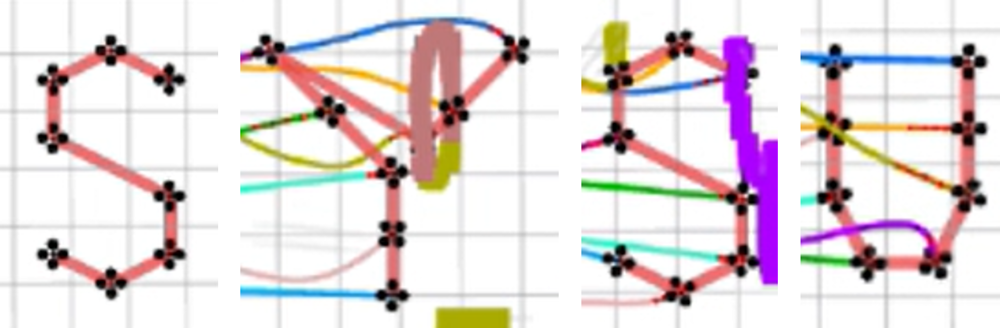

# Swarm-Control

> [!NOTE]
> 任务要求详见[SYSU-HILAB/Swarm-Control-Course-Additional-Work](https://github.com/SYSU-HILAB/Swarm-Control-Course-Additional-Work)，实现方法详见[ZJU-FAST-Lab/Swarm-Formation](https://github.com/ZJU-FAST-Lab/Swarm-Formation)。本项目仅是对上述项目进行了些许修改。

## 实现要求

1. 可以使用不限数量的无人机组成编队。
2. 无人机在飞行过程中依次变换出"S"，"Y"，"S"，"U"四种队形，允许起始队形为字母"S"。
3. 仿真场景已固定随机种子，请不要修改`map_generator`的代码以及`normal_hexagon.launch`文件中该节点的参数。

## 快速开始

建议使用Ubuntu 20.04，ROS Nonetic进行编译。

```bash
sudo apt-get install libarmadillo-dev
git clone https://github.com/lankoestee/swarm-control.git
cd swarm-control
caktin_make -j1
source devel/setup.bash
roslaunch ego_planner rviz.launch
```

在另一个命令行窗口上运行

```bash
source devel/setup.bash
roslaunch ego_planner sysu.launch
```

如果有自动放点的需要，则可以在另一个窗口上运行`bash goal.sh`。

## 实现效果

为了实现顺畅的显示，我编写了`goal.sh`文件用于定期发布`/move_base_simple/goal`话题。当然，也可以通过使用rviz来指点发布对应话题。这都将实现4个编队形状的轮流切换。下图展示了所示的结果。




## 编队修改

本仓库默认实现的是SYSU的无人机编队，如果有编队扩展的需要，可以按照如下的步骤进行修改。

### 修改编队形状

1. 修改编队形状：进入`src/planner/plan_manage/config/sysu.yaml`文件，修改44行往后的部分，这里的四个`global_goal`分别代表了编队的四个变换的姿态。修改其中的`relative_pose`即可实现编队形状的修改。
2. 修改编队可视化连线：进入`src/planner/traj_utils/src/planning_visualization.cpp`文件，修改216行至226行的内容，其中`line_size_`代表连线的数量，`line_begin_`和`line_end_`分别代表了连线的起始飞机编号和终止飞机编号。修改这些参数即可实现编队连线的修改。

### 修改飞机数量

1. 修改飞机数量：进入`src/planner/plan_manage/config/sysu.launch`文件，根据所需要的数量修改对应的`drone_id`的数量即可。其中的`init_(xyz)`代表了飞机的初始位置，需要修改，其余参数复制即可。（有些参数没有派上用场，但是如果删除会导致程序无法运行）
2. 修改参数加载数量：进入`src/planner/plan_manage/src/ego_replan_fsm.cpp`文件，修改第55行的循环次数即可。